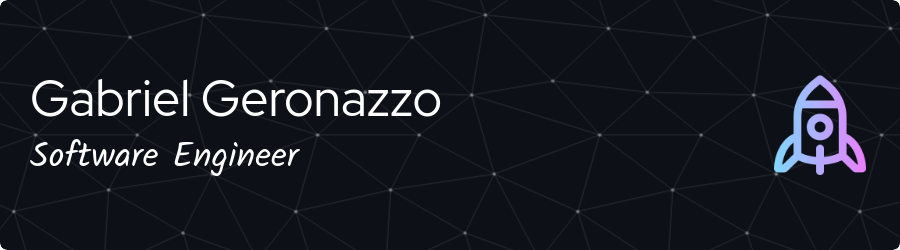

<h2 align="center">👋 Welcome to my GitHub Universe!</h2>

  

### 🌌 About Me

Hello! My name is Gabriel Ken Kazama Geronazzo, and I am a software engineer passionate about challenges and driven by a proactive mindset. I firmly believe that the best way to learn is by teaching, which led me to document my learning journey on my [GitHub](https://github.com/ImGabreuw/notes). This experience not only accelerated my growth but also allowed me to build valuable connections with other developers, creating a network of knowledge and mutual support.

My goal for 2023 is to further enhance my knowledge in Machine Learning and explore cloud computing services to create efficient and innovative solutions in the financial market, contributing to the growth of companies and positively impacting people's lives.

### 🛠️ Technologies and Tools

### 🤝 Let's Connect!

Feel free to get in touch with me to discuss projects, exchange ideas, and explore new collaboration opportunities.

  
  
  

  

